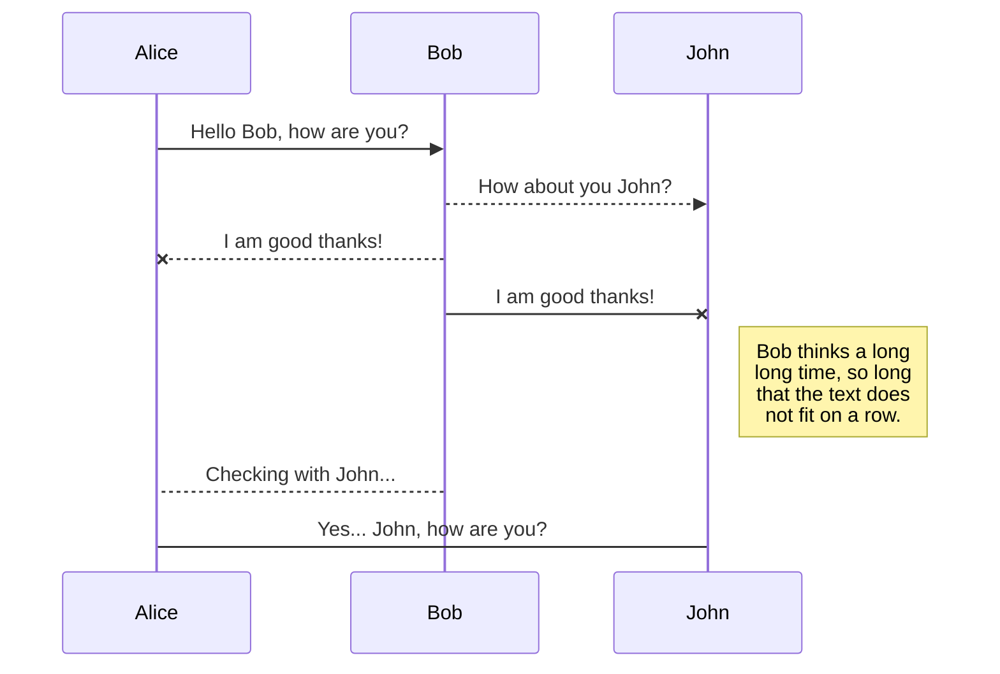
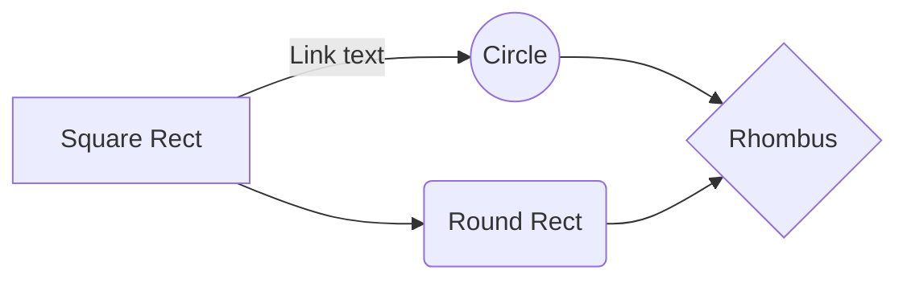

# <center>MARKDOWN</center>

**Markdown** Ç uma linguagem simples de marcaáÑo originalmente criada por John Gruber e Aaron Swartz que converte texto em HTML v†lido.  
Markdown Ç frequentemente usado para formatar arquivos README, para escrever mensagens em f¢runs de discussÑo online e para criar rich text usando um editor de texto simples.

A rede social para desenvolvedores: **Github** Ç compat°vel com a linguagem Markdown. 

Os arquivos **README.md** dos reposit¢rios no Github, sÑo feitos com a linguagem Markdown.

> **.md**  Ç a extensÑo para os arquivos em Markdown.

Outra linguagem de marcaáÑo Ç a *HTML*.  Essas linguagens sÑo para desenvolvimento. NÑo sÑo linguagens de programaáÑo. 

___

##  T¢picos do conte£do <!--ancoras-->

[Hier†rquia de t°tulos](#titulos)  
[Linha horizontal](#hr)  
[Par†grafos](#p)  
[Quebra de linha](#br)  
[FormataáÑo b†sica](#formatar)  
[Mostrar os s°mbolos de Markdown no texto](#simbolos)
[CitaáÑo](#citar)  
[C¢digos de linguagens](#code)  
[](#)  
[](#)  
[](#)  
[](#)

___

<div id="titulos">
## Hier†rquia de t°tulos

- \# T°tulo n°vel 1
- \## T°tulo n°vel 2
- \### T°tulo n°vel 3
- \#### T°tulo n°vel 4
- \##### T°tulo n°vel 5
- \###### T°tulo n°vel 6 

Pode-se tambÇm fazer o t°tulo e subt°tulo assim:

~~~
T°tulo principal 
===

Subt°tulo 
---
~~~


<div id="hr">
## Linha horizontal

- 3 traáos \---
- 3 asteriscos \***
- 3 underlines ___


<div id="p">
## Par†grafos

Vocà pode criar um novo par†grafo deixando uma linha em branco entre as linhas de texto.


<div id="br">
## Quebra de linha

Pode-se usar **2 espaáos no final da linha** ou a tag \<br> - quebra de linha do HTML no arquivo em Markdown. 

 As tags HTML sÑo aceitas em Markdown.


<div id="formatar">
## FormataáÑo b†sica

** Negrito:** SÑo 2 asteriscos ou 2 underlines ou Ctrl B. `**negrito** ou __negrito__ ` **texto em negrito**

** It†lico:** Ç 1 asterisco ou 1 underline ou Ctrl I. `*it†lico* ou _it†lico_` *texto em it†lico*

** Texto exclu°do:** sÑo 2 tils. `~~riscado~~` ~~texto exclu°do~~

** Negrito-it†lico:** sÑo 2 asteriscos e 1 underline. `**_negrito-it†lico_**` *__txto em negrito-it†lico__*  

** Todo o texto em negrito it†lico:** sÑo 3 asteriscos. `***Tudo em negrito e it†lico*** ou ___tudo em negrito e it†lico___` ***Tudo em negrito e it†lico de forma mais simples.***

___

Isso Ç poss°vel em Markdown?

 Texto  sublinhado  
 Texto marcado com cor
___


<div id="simbolos">
## Mostrar os s°mbolos de Markdown no texto

Para mostrar exatamente o s°mbolo basta usar uma barra invertida \ antes. Isso para o efeito de formataáÑo. Exemplo: `\#` mostrar† o s°mbolo \# sem o efeito de t°tulo.  


<div id="citar">
## CitaáÑo

O sinal de `>` no in°cio da linha indica uma citaáÑo. 

> Vocà pode citar automaticamente o texto em um coment†rio ***destacando o texto e digitando R***.

### CitaáÑo aninhada

Para criar um bloco aninhado de citaáîes, utilize **2 ou mais sinais de maior que** `>>` antes do par†grafo.

~~~
> Resultado da citaáÑo aninhada
>
>> citaáÑo n°vel 2
>> 
>>> citaáÑo n°vel 3
>>> 
>>>> citaáÑo n°vel 4
>>>>
~~~
> Resultado da citaáÑo aninhada
>
>> citaáÑo n°vel 2
>> 
>>> citaáÑo n°vel 3
>>> 
>>>> citaáÑo n°vel 4
>>>>


<div id="code">
## C¢digos de linguagens

 **C¢digo inline ** colocar entre crases \` \` O c¢digo delimitado ou Ctrl E. Isso faz o texto ficar com uma fonte monoespaáada e com fundo acinzentado para dar destaque. Exemplo: `window.document.querySelector()` Ç escrito em linguagem JavaScript.

 **C¢digo em linhas ** colocar o c¢digo entre 3 crases ``` ou 3 tils ~~~ consecutivos sem espaáo entre eles.

~~~ python
    num = int(input('Digite um n£mero: ')) 
    if num % 2 == 0: 
        print(f'O valor {num} Ç PAR') 
    else: 
        print(f'O valor {num} Ç ãMPAR') 
    print('Fim do Programa') 
~~~

 **C¢digo de linhas simples ** Colocar 4 espaáos para antes do texto. 

    Exemplo para textos.

     Essa forma nÑo Ç indicada para colocar trechos de linguagens de programaáÑo.


## 2.9. Links

S°mbolo **\[link](URL)**  onde a descriáÑo fica entre colchetes e o endereáo do link entre parànteses.

Exemplo: [Pesquisa Google](https://www.google.com/ target="_blank")

 **Link relativo**  \[link](docs/CONTRIBUTING.md) _ pode usar os operandos ./ e ../ para acessar as pastas.

 **Link direto**  envolva o endereáo da web entre chaves <> ou colocar a URL completa. https://www.google.com/


## 2.10. èncoras

Fazer Éncoras no texto, ou seja, links dentro do texto.

**\[Hier†quia de t°tulos](#hierarquia-titulos)**  leva a p†gina atÇ o conte£do referenciado por uma div: **\<div id="hierarquia-titulos">**

 Exemplo: [Hier†quia de t°tulos](#hierarquia-titulos)

 Com esse exemplo Ç poss°vel criar sum†rios e °ncices de t¢picos no texto.


## 2.11. Imagens

S°mbolo **\!\[img](URL)**  abre colchetes vazio e a URL da imagem entre parànteses. 


 **Imagem com t°tulo**  colocar uma descriáÑo da imagem quando passar o mouse sobre ela. Tem a mesma funáÑo da tag \<title> do Html. Para isso, coloque ap¢s a url da imagem, a descriáÑo entre aspas duplas: \!\[ ](URL "descriáÑo").


 **Imagem com link**  faz a imagem ir para um link. **\[](link)**.

[](https://commons.wikimedia.org/wiki/File:Markdown-mark.svg)


**img completo**


___

## 2.12. Emojis

SÑo representados entre s°mbolos de **:emoji:**

:eyes:  :muscle:  :clap:  :+1:

??      ??       ??      ??

 Emoji-Cheat-Sheet  
 https://github.com/ikatyang/emoji-cheat-sheet/blob/master/README.md

___

<div class="footer">
    <center>&copy; 2022 Karine s m Rodrigues</center>
</div>

## KaTeX

You can render LaTeX mathematical expressions using [KaTeX](https://khan.github.io/KaTeX/):

The *Gamma function* satisfying $\Gamma(n) = (n-1)!\quad\forall n\in\mathbb N$ is via the Euler integral

$$
\Gamma(z) = \int_0^\infty t^{z-1}e^{-t}dt\,.
$$

> You can find more information about **LaTeX** mathematical expressions [here](http://meta.math.stackexchange.com/questions/5020/mathjax-basic-tutorial-and-quick-reference).


## UML diagrams

You can render UML diagrams using [Mermaid](https://mermaidjs.github.io/). For example, this will produce a sequence diagram:



And this will produce a flow chart:

