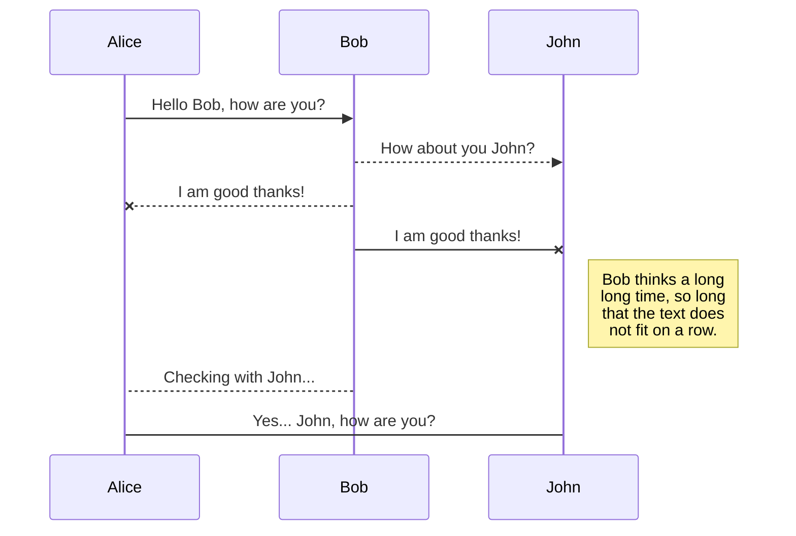
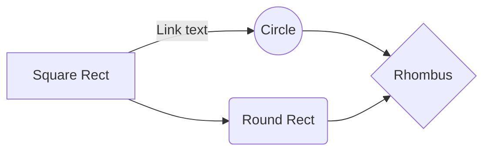

# ☺ MARKDOWN ✍ 

**Markdown** é uma linguagem simples de marcação originalmente criada por John Gruber e Aaron Swartz que converte texto em HTML válido.  
Markdown é frequentemente usado para formatar arquivos README, para escrever mensagens em fóruns de discussão online e para criar rich text usando um editor de texto simples.

A rede social para desenvolvedores: **Github** é compatível com a linguagem Markdown. 

Os arquivos **README.md** dos repositórios no Github, são feitos com a linguagem Markdown.

`.md` → é a extensão para os arquivos em Markdown.

Outra linguagem de marcação é a *HTML*.  
Essas linguagens são para desenvolvimento. Não são linguagens de programação. 

___

<div id="topicos">
 
## ▼ Tópicos do conteúdo

[Hierárquia de títulos](#titulos)  
[Linha horizontal](#hr)  
[Parágrafos](#p)  
[Quebra de linha](#br)  
[Formatação básica](#formatar)  
[Mostrar os símbolos no texto](#simbolos)  
[Citação simples e aninhada](#citar)  
[Inserir códigos](#code)  
[Links](#links)  
[Âncoras](ancoras)  
[]() []() []()

_


<div id="titulos">

## ✎ Hierárquia de títulos 

- \# Título nível 1
- \## Título nível 2
- \### Título nível 3
- \#### Título nível 4
- \##### Título nível 5
- \###### Título nível 6 

☞ Pode-se também fazer o título e subtítulo assim:
~~~
Título principal 
===

Subtítulo 
---
~~~
 
  
<div id="hr">
 
## Linha horizontal

- 3 traços \---
- 3 asteriscos \***
- 3 underlines ___


<div id="p">
 
## Parágrafos

Você pode criar um novo parágrafo deixando uma linha em branco entre as linhas de texto.


<div id="br">

## Quebra de linha

Pode-se usar **2 espaços no final da linha** ou a tag \<br> - quebra de linha do HTML no arquivo em Markdown.  
As tags HTML são aceitas em Markdown.


<div id="formatar">
 
## Formatação básica

**▬ Negrito:** São 2 asteriscos ou 2 underlines ou Ctrl B. `**negrito** ou __negrito__`  **texto em negrito**

**_▬ Itálico:_** é 1 asterisco ou 1 underline ou Ctrl I. `*itálico* ou _itálico_`  *texto em itálico*

**▬ Texto excluído:** são 2 tils. `~~riscado~~` ~~texto excluído~~

**▬ Negrito-itálico:** são 2 asteriscos e 1 underline. `**_negrito-itálico_**` *__texto em negrito-itálico__* 

**▬ Todo o texto em negrito-itálico:** são 3 asteriscos ou 3 underlines. `***Tudo em negrito e itálico*** ou ___tudo em negrito e itálico___` ***Tudo em negrito e itálico de forma mais simples.***

___
 
Isso é possível em Markdown?  
🟡 Texto  sublinhado  
🟡 Texto marcado com cor 
___


<div id="simbolos">
 
## Mostrar os símbolos no texto

Para mostrar exatamente o símbolo basta usar uma barra invertida \ antes do símbolo. Isso faz parar o efeito de formatação.
 
Exemplo: `\#` mostrará o símbolo \# sem o efeito de título. 
 
\# Título sem a formatação padrão.
 
 
<div id="citar">
 
## Citação
 
O sinal de `>` no início da linha indica uma citação. 

> Você pode citar automaticamente o texto em um *comentário* ***destacando o texto e digitando R***.

### Citação aninhada

Para criar um bloco aninhado de citações, utilize **2 ou mais sinais de maior que** `>>` antes do parágrafo.
 
~~~
> Resultado da citação aninhada
>
>> citação nível 2
>> 
>>> citação nível 3
>>> 
>>>> citação nível 4
>>>>
~~~
> Resultado da citação aninhada
>
>> citação nível 2
>> 
>>> citação nível 3
>>> 
>>>> citação nível 4
>>>>
 
    
<div id="code">

## Inserir códigos de linguagens

▬ **Código inline →** colocar entre crases \` \` O código delimitado ou Ctrl E. Isso faz o texto ficar com uma fonte monoespaçada e com fundo acinzentado para dar destaque. Exemplo: `window.document.querySelector()` é escrito em linguagem JavaScript.

▬ **Código em linhas →** colocar o código entre 3 crases ``` ou 3 tils ~~~ consecutivos sem espaço entre eles.

\~\~\~ python  
 num = int(input('Digite um número: '))  
 if num % 2 == 0:  
     print(f'O valor {num} é PAR')  
 else:  
     print(f'O valor {num} é ÍMPAR')  
 print('Fim do Programa')  
\~\~\~ 
 
~~~ python
    num = int(input('Digite um número: ')) 
    if num % 2 == 0: 
        print(f'O valor {num} é PAR') 
    else: 
        print(f'O valor {num} é ÍMPAR') 
    print('Fim do Programa') 
~~~

▬ **Código de linhas simples →** Basta colocar 4 espaços antes do texto. 

    Exemplo para textos.

    ☞ Essa forma não é indicada para colocar trechos de linguagens de programação.


<div id="links">
 
## Links

O símbolo `[link](URL)` → onde a descrição fica entre colchetes e o endereço do link entre parênteses.

Exemplo: [Pesquisa Google](https://www.google.com/)

▬ **Link relativo** → `[link](docs/CONTRIBUTING.md)` → pode usar os **operandos ./ e ../** para acessar as pastas.

▬ **Link direto** → envolva o endereço da web entre **chaves <>** ou colocar a URL completa. https://www.google.com/


<div id="ancoras">
 
## Âncoras

Fazer âncoras no texto, ou seja, links dentro do texto.

`[Tópicos](#topicos)` → leva a página até o conteúdo referenciado por uma div `<div id="topicos">` 

☞ Exemplo: [Ir para Tópicos](#topicos)

✎ Com esse exemplo é possível criar sumários e íncices de tópicos no texto.


## 2.11. Imagens

Símbolo **\!\[img](URL)** → abre colchetes vazio e a URL da imagem entre parênteses. 


♦ **Imagem com título** → colocar uma descrição da imagem quando passar o mouse sobre ela. Tem a mesma função da tag \<title> do Html. Para isso, coloque após a url da imagem, a descrição entre aspas duplas: \!\[ ](URL "descrição").


♦ **Imagem com link** → faz a imagem ir para um link. **\[](link)**.

[](https://commons.wikimedia.org/wiki/File:Markdown-mark.svg)

 **img completo**


___

## 2.12. Emojis

São representados entre símbolos de **:emoji:**

:eyes:  :muscle:  :clap:  :+1:

👀      💪       👏      👍
 
☚ ☛  ☜  ☝  ☞  ☟  ✌   ✍  ☁  ☄ ☀ ♨ ❄  ✟ ☎ ✂ ☢ ⌛  ✏ ✎ ☠
 
:warning:  :heavy_check_mark:  :link:  :o:  :memo:  :pushpin:  :sunny:  :sweat_drops:  :vertical_traffic_light: :interrobang: :white_circle: :octocat:


► Emoji-Cheat-Sheet  
► https://github.com/ikatyang/emoji-cheat-sheet/blob/master/README.md
 https://github.com/ikatyang/emoji-cheat-sheet


 
 █ video
 <a href="http://www.youtube.com/watch?feature=player_embedded&v=YOUTUBE_VIDEO_ID_HERE" target="_blank"></a>
 
 
 
 ## KaTeX

You can render LaTeX mathematical expressions using [KaTeX](https://khan.github.io/KaTeX/):

The *Gamma function* satisfying $\Gamma(n) = (n-1)!\quad\forall n\in\mathbb N$ is via the Euler integral

$$
\Gamma(z) = \int_0^\infty t^{z-1}e^{-t}dt\,.
$$

> You can find more information about **LaTeX** mathematical expressions [here](http://meta.math.stackexchange.com/questions/5020/mathjax-basic-tutorial-and-quick-reference).


## UML diagrams

You can render UML diagrams using [Mermaid](https://mermaidjs.github.io/). For example, this will produce a sequence diagram:



And this will produce a flow chart:


 
 
 https://lealtudo.blogspot.com/2013/09/codigo-de-teclado-alt-ascii-alt.html
 ___

<div class="footer">
    <center>&copy; 2022 Karine s m Rodrigues</center>
</div>
